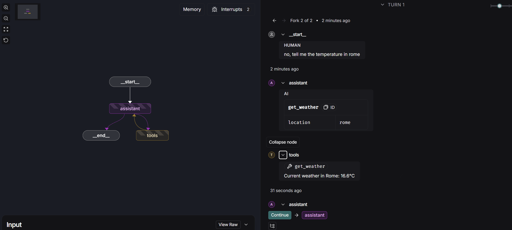

# **MODULE 1**

## **VIDEO 1- Motivation**

A solitary language model is fairly limited because it doesn't have access to multi-step workflows. Which is why a lot of LLM applications use a control flow with steps before and after LLM calls, like including tool calls, retrieval calls etc.

The control flow is called a chain. An Agent then, is a control flow thats actually defined by the LLM. Its flexible and the LLM chooses what steps to take depending on the problem or situation faced instead of a procedural step-by-step fixed routine.

There are many kinds of Agents. A router is an agent that controls a single step in the flow. A fully autonomous agent can pick any sequence of steps. It can also generate its own step. A drawback is that the applications reliability decreases inversely with more control given to the LLM.

Langgraph gives you a way to implement custom control flows in the form of graphs with nodes connected by edges.

There was no code for this video.

---

## **VIDEO 2- Simple Graph**

[simple-graphVID2MOD1.ipynb](./Module1/simple-graphVID2MOD1.ipynb)

In this video, we built a simple graph with 3 nodes and 1 conditional edge. The first node has a conditional edge that either goes to node 2 or node 3.

There are some concepts defined. A state is the object that we pass between the node and the edge. A node is basically a python function. We pass the state to the node. Each new node returns the new value of the state key and overrides the previous value. Edges connect the nodes.  

In this file, I've made a change so that the program checks the current date-time and if its before evening routes to saying that its awake, and if its post evening then states that its sleepy. We construct a graph by defining a START node and an END node, before we invoke it.

---

## **VIDEO 3- Langgraph Studio**

We learnt how to utilize langgraph studio, which is an IDE for building, visualizing, and debugging AI agent workflows made with LangGraph. We can see visual graphs with all the nodes and see how they process inputs/outputs more clearly. We need a studio folder in our directory that has a langgraph.json file in it which has the graphs that we want to see and our .env file. I made a copy of my jupyter notebook .ipynb file into .py files to save in the studio folder in my directory and then ran the command to view langgraph studio. We can see what each node does and which node is running real time in the studio.

There is no code in this video so i just interacted with langgraph studio. Here in the image you can see at my input of the GraphState the output gives me the line "I am sleepy" this is because my code in the relevant simple-graph file, at node 1 the program checks the current date-time of the system and if it is after evening it routes it to the node to say the phrase "I am sleepy". In my jupyter notebook file you can see when I ran the code intitially the graph gave "I am awake" as it was before 6pm.

---

## **VIDEO 4- Chain**

[chainVID4MOD1.ipynb](./Module1/chainVID4MOD1.ipynb)

In this video, we see how to build a chain integrating chat messages, chat models and tool calls.
Langchain has different message types that are used to capture different roles in conversations. I have used gemini instead of OpenAI and have configured my code according to that. I learnt how to pass messages as inputs to chat models, and how to bind tools to chat models, and how to produce tool called outputs. I've learnt that we can use messages in our graph state.

We don't want messages to be overwritten in the state, instead we want them to append to the state so as to maintain message history. For this, we use reducers. Reducers allow us to specify how we want state updates to happen instead of just overriding. 

We've built a graph with MessageState and tool calling. For this module, I added on to the multipying tool and added division, addition, and subtraction tools as well. Other than that, I added a tool to tell current date-time, as well as a tool that tells the weather in a specified location that the user mentions. I have also changed the messages passed to the state. 

---

## **VIDEO 5- Router**

[routerVID5MOD1.ipynb](./Module1/routerVID5MOD1.ipynb)

We've seen that a graph can return either a tool call or a natural language response This is a router where a chat model routes between either a direct response or a tool call based on user input. Now I've extend the previous learnings in the file to add a node that calls the tool itself. I've also added a conditional edge that will look at the chat model output and rooute to our tool calling node or end if no tool call is performed.

We can now see the actual output when our tools are used, I've used the tools I defined myself before and I can now see the outputted temperature in New York through the tool call of the weather tool and the current date-time through the tool call of the date-time tool, as well as the results from all the arithmetic functions.

In this image we have utilized Langgraph studio to see the graph. Here we can also input messages and see the result of the tool calling LLM, where it chooses which tool to call to give the correct output. Here you can see the outputs from calling the tools to see current date-time and the weather in a user specified location. These are custom tools that I made. 

In this image you can see 2 of the arithemetic tools I defined. I also defined seperate tools for addition and subtraction as seen in the jupyter notebook file.

---

## **VIDEO 6- Agent**

[agentVID6MOD1.ipynb](./Module1/agentVID6MOD1.ipynb)

We can make simple modifications to the router to turn it into popular agent architecture, ReAct. The model calls specific tools as previously seen, and now the tool output is passed back to the model. The model then decides what to do next with the tool output ( call another tool or respond directly). 

I have first defined all the tools I previously used, basic arithemetic (addition, subtraction, multiplication, division) and the environmental variable tools (current date, current time, fetching weather of specific location). I have also added more arithemtic tools (square of input, root of input, and modulo). I have attatched screenshots of the tracing on langsmith for 2 queries I ran, one was a series of arithemetic operations and the other was a series of requests about date/time/weather. Langsmith tracing showcases the multiple tool calls before the output.

---

## **VIDEO 7- Agent Memory**

[agent-memoryVID7MOD1.ipynb](./Module1/agent-memoryVID7MOD1.ipynb)

In this section, I learnt how to extend the previous agent architecture to include memory. We run the previous agent and try to ask a follow up arithemetic question on the output of the previous result. This doesn't work because there is no memory saved of previous outputs. There is no persistence between executions.

Langchain uses checkpointers to save the GraphState after each step. We use the MemorySaver checkpointer, which is an in-memory key-value store for GraphState. We compile the graph with the checkpointer, which gives memory to the graph. I have used the agent I established in the previous file and demonstrated that the agent retains memory and can call tools and perform the arithmetic functions on a previous output given by the agent that it remembers. 

Here we can see it in langgraph studio where we input a question that calls some tools that I have defined and gives an output, then we ask it to do further operations on the previous output and it is able to do that with its memory.

---

# **MODULE 2**

## **VIDEO 2- State Schema**

[state-schema.ipynb](./Module2/state-schema.ipynb)

In module one, we've covered how to make oan agent with memory that can use tools and can decide what to do next based on tool call outputs. In this video, we extend about this and go deeper into the state.  When defining a langgraph StateGraph, you use aa state schema, which comprimises of the structure and the type of data the graph will use. We have previously been using TypeDict which is a dictionary with type hints as keys that are not enforcable in runtime. 

We use TypeDict first where I have *changed*:

- Defined a 2 level decision tree with several nodes based on selecting a genre of book to read + time taken to read, the decison tree first randomly selects a node out of 3 nodes for book genres (horror, fantasy, sci-fi) and then theres 2 more nodes that are connected individually to all three of these nodes that define a short reading time or a long reading time. 

Now I have used dataclass and pydantic to define the same graph that I have modified with more nodes and branches. DataClass, used to define a class of structured data, also does not enforce type hints at runtime, which is why we use Pydantic when we want data validation.

---

## **VIDEO 2- State Reducers**

[state-reducers.ipynb](./Module2/state-reducers.ipynb)

In this video we learn about state reducers which specify how state updates are performed on specific keys or channels in the schema. Whenever we invoke a graph, langgraph doesn't know the preffered way to update the state, so the default method is to override the value from before. We see this in an example of a branching graph where the key can only recieve one value per step, but since parallel processes are trying to occur and overwrite the value at the same time, an error occurs.

This is why we use Annotated key to handle multiple values. We apply the annotated type to our key and include a reducer function, which performs a list concatenation instead of overwriting. So when 2 processes occur at once, they are not trying to overwrite at the same time but just append, this is useful for performing state updates simultaneously.

We've also learnt to define custom reducers to handle specific inputs like edge cases (null value here)

We also learn more about MessagesState and defining a custom one, add_messages is a built in reducer.

The changes I have made are changing the key from foo to book_title which is a string. The rest of the code is modified to show the functionality of reducers using string and not int. The graph nodes are defined to be about tracking books and genres in a library, and the reducers show the book list being appended. The messafesstate section is modified to include a thread of conversation about book reccomendation.

---

## **VIDEO 3- Multiple Schemas**

[multiple-schemas.ipynb](./Module2/multiple-schemas.ipynb)

All graphs nodes usually contain a single schema, but there are cases where multiple schemas may be needed. Innternal nodes may pass information that is not required to the graph's input/output, or we might want to use different input/output schemas for the graph.
So in this video we learn different ways to customise a schema.

First, we learn about Private State, which is used when needed as part of an intermediate logic but not as part of final input/output. PrivateState is not in the overall state thats passed back to the user but we can see that the intermediate nodes use PrivateState to communicate.

We also learn about having a specific input/output schema. These work as filters on the overall state that specify what you want as the input and the output to be. Here we just want the question and answer and want the intermediate thinking node hidden from the user, which is what we implement here.

I have *changed* a couple things. In private state, I have added more nodes with intermediate arithemetic operations that sequentially perform operations. In the input/output schema section, I have customised the messages.

---

## **VIDEO 4- Trim Filter Messages**

[trim-filter-messages.ipynb](./Module2/trim-filter-messages.ipynb)

Now we know how to customize graph states, define state reducers, and use multiple schemas. Now from this video we will start building towards a chatbot that has long term memory. 

We can past a simple list of messages to the chat model and run our chatmodel in a simple graph using MessagesState. The issue here is managing long running conversations with the agent. It is very token expensive which is costly.  So to solve this problem, we can use the Remove_Message and add_messages reducer. We define a function that takes in the state and deletes all but the last 2 most recent messages.
We can also filter the messages and send a subset of the message list. We can also limit token usage.

I have made extensive changes. Firstly, as I did not want to use OpenAI I've used gemini-2.0-flash throughout the module. Secondly, I have modified this agent to be catered to book reccomendation questions and answers based on the user's taste.

We see in this screenshot of the trace that the input to the chatmodel excludes the previous history and only includes the last input. 

This limited the tokens used. 

---

## **VIDEO 5- Chatbot with Summarizing Messages and Memory**

[chatbot-summarization.ipynb](./Module2/chatbot-summarization.ipynb)

In this video we learn how to utilize LLM's to produce running summaries of the conversation. This helps us compress and preserve information better than filtering or trimming the messages. The summary is stored in the state and massively reduces token usage. If a summary is present it is added to the messages, if not, it just takes what is in messages and invokes the model.If there is a summary the existing summary is added to the summary prompt, otherwise, a summary of the conversation is created. Theres a custom edge added that only allows creation of summary if there are more than 6 messages. 

In this file, I did not want to use OpenAI so I have configured the code to use gemini. Other than that, I have also changed the message thread to be about discussing a particular character in a book series. 

In this screenshot we can see the multiple traces formed that are linked together in the summary. 

---

## **VIDEO 6- Chatbot with Summarizing Messages and External Memory**

[chatbot-external-memory.ipynb](./Module2/chatbot-external-memory.ipynb)

Previously, we've made a chatbot that supports long running conversations either by using in-memory checkpointers that allows us to persist the memory of the conversation or by using summarizations if the chat messages which reduces overall token usage. The drawback of this is that it only persists during the notebook's session. So in this video we have learnt how to use an external memory through SQLite. Its a small and fast database that we utilise to work with external database checkpointers. We can see that it allows conversation history and summaries to persist across notebooks or kernel restarts, which creates a better long term memory. 

Here also I've configured the code to use Gemini instead of OpenAI and have customized the conversation threads.

---

# **MODULE 3**

## **VIDEO 1- Streaming**

In the previous module we've learnt about state and memory and built a chatbot with external memory that can sustain long running conversations. We're going to  be learning about human-into-the-loop. In this video, we learn  about streaming.

Theres two different ways of streaming in langgraph .stream and .astream. The values node streams the state of the graph after each node is called and the updates node streams updates to the state of the graph after each node is called.

We can use .astream_events to stream back events as they happen in the model.
An event contains the following keys:
1. event:type of event being emitted
2. name:name of event
3. data: data associated with the event
4. metadata: has the node emitting the event

I've used gemini through langchain instead of OpenAI throughout the code and some tweaks have been made to accomodate this change. Other than that, I have incorporated token tracking, and time tracking in the code as well. I've also created a seperate kernel that compares the two streaming modes, Values and Updates in terms of events and time taken, for an inputted message. I have also custimized all conversation topics.

---

## **VIDEO 2- Breakpoints**

In this video we learn how to implement breakpoints so that we can implement the concept of human-in-the-loop. This is specifically helpful because-
-We can interrupt the agent, pass on the state to the user, and allow the user to approve the action before the tool is called
-We can modify the state
-We can do better debugging

Here we're implementing breakpoints before tool calls. The current state before the tool call with the args will be given to the user to approve before moving on to the actual tool calling.

In my file, as previously done, I've used gemini through langchain instead of OpenAI. I've added several tools other than the standard multiplication, division and addition tools, I've completed the set of basic arithemetic operations and added a subtraction tool. Other than this I have also added tools for more mathematical functions, for modulo, square, and square root. I've also added some tools related to environmental factors, namely the date-time tool to tell current date and time, and a tool which takes user input of a location and outputs the weather in that location through the utilization of Open-meteo API. I've demonstrated the functioning of these tools both in the jupyter notebook as well as in the langgraph studio screenshots. You can also see that I've worked the breakpoints in a way so that they're called multiple times for inputs with mutliple tool calls befor each tool call. 

Here we can see the tool calling with breakpoints being visible before each tool 

demonstration of some other tools

---

## **VIDEO 3- Editing State and Human Feedback**

We learnt in the previous video to use breakpoints to stop the graphs and approve certain actions. Now in this video we'll learn how to edit the GraphState once its stopped. We use breakpoints to modify the state of the graph using update_state(). The Langgraph Studio UI also gives us the ability to add interrupts. I've added an additional interrupt at assistant. I've also maintained my previous changes of several new tools and using gemini instead of OpenAI.

We also learned about adding human feedback to perform state updates, by adding a node that serves as a placehodler for human feedback. Adding this in the loop means that the user can add feedback directly to the state. 

here we see we fork the input and enter a different value, this means we manually added a breakpoint 

output is here after we manually approve due to human-in-the-loop 

---

## **VIDEO 4- Dynamic Breakpoints**

In this video we learn about cases where we want the graph to be able to interrupt itself based on some condition with the state of the graph. We can use NodeInterrupt for it. After the state is paused and when we want to continue, we juse update the state.

In this I added an addition step that interrupts when a keyword such as "stop", "exit", etc is used, I've also demonstrated this in the screenshots and the file. 

Here we can see that the input "hi" doesn't pause the state as it doesn't contain the specified keywords and is under 5 chars

Here it is halted due to the keyword

here it is halted due to char limit

---

## **VIDEO 5- Time Travel**

Now in this video we learnt about how langgraph supports debugging by viewing, replaying and forking prior states. We've used the same agent we previously used in the module. 

We've learned about Browsing History, where we can use get_state to get the State Snapshot, as in the checkpoint of the current state of the graph. We also get metadata. We can also use get_state_history to look at the history of states at every step that the agent took. Checkpoints just wrap the state and relevant metadata at every step, so when we're looking at State Snapshots we're looking at the checkpoints essentially. 

We also learnt about Replaying, where the concept is that we can replay the agent from any of its prior steps. If we pass in a thread id and a checkpoint id then we can rewind to any checkpoint within the thread. 

Then we finally learnt about Forking, where we run from the same step but from a different input. To rewind and fork a previous checkpoint, we update state, pass the checkpoint id, then we get a forked checkpoint that's created. Essentially, if we pass in a State Snapshot thats never been executed before, then instead of replaying (what it would do if it had been executed before), it gets forked. When we're forking, we also provide id of the initial checkpoint, so it overwrites it.

Here we can see the place in langgraph studio to edit the values of the state when adding an interrupt at assistant and after chaning the values forking the input. 

